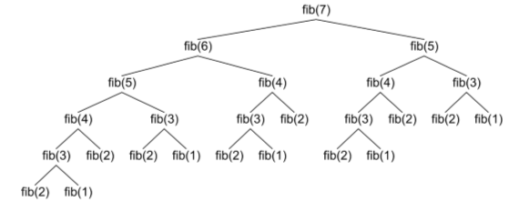

# BFS(Breadth-First Search)

너비 우선 탐색

그래프 자료구조에서 모든 노드를 방문하는 알고리즘이다.

## 큐 이용한 구현 (DFS 와 차이는 스택 대신 큐를 사용한다는 것)

다차원 배열로 생각해보자.

방문한 좌표를 담기 위해 큐를 사용해서 구현한다. (방문 처리를 위한 2차원 배열도 필요하다.)

1. 시작 좌표를 큐에 넣는다. (+방문 처리를 한다.)
2. 큐에서 좌표를 하나 꺼낸다.
3. 그 좌표에 인접한 상하좌우 칸을
    - 이미 방문했었다면 큐에 넣지 않는다.
    - 아직 방문하지 않았다면 큐에 넣는다. (+방문 처리를 한다.)
4. 큐가 빌 때까지 2~3을 반복한다.

큐에 들어간 순서가 탐색하는 순서가 된다.

# DFS(Depth-First Search)

깊이 우선 탐색

그래프 탐색 알고리즘 중 하나로, 다차원 배열에서 각 칸을 방문할 때 깊은 부분을 먼저 탐색하는 알고리즘이다.

DFS는 스택 자료구조 또는 재귀함수를 이용하여 구현한다.

## 스택을 이용한 구현

다차원 배열로 생각해보자.

방문한 좌표를 담기 위해 스택을 사용해서 구현한다. (방문 처리를 위한 2차원 배열도 필요하다.)

1. 시작 좌표를 스택에 넣는다. (+방문 처리를 한다.)
2. 스택에서 좌표를 하나 꺼낸다.
3. 그 좌표에 인접한 상하좌우 칸을
    - 이미 방문했었다면 스택에 넣지 않는다.
    - 아직 방문하지 않았다면 스택에 넣는다. (+방문 처리를 한다.)
4. 스택이 빌 때까지 2~3을 반복한다.

## 재귀함수란?

자기 자신을 다시 호출하는 함수

(파이썬에서는 어느 정도 출력하다가 최대 재귀 깊이를 초과하면 RecursionError 발생하고 종료한다.)

### Base condition

재귀함수는 반드시 종료 조건을 명시해야 한다. 어떤 입력에 대해서는 자기 자신을 호출하지 않고 종료해야 한다.

```python
def recursive():
  if 종료조건:
      return
  recursive()
```

## 재귀함수를 이용한 예시

### 1. 팩토리얼

재귀함수를 사용하지 않고 구현한 예시
```javascript
function factorial(n) {
  let result = 1;
  for (let i = 1; i <= n; i++) {
    result *= i;
  }
  return result;
}
```

재귀함수를 사용하여 구현한 예시
```javascript
function factorial(n) {
  if (n <= 1) {
    return 1;
  }
  return n * factorial(n - 1);
}
```

### 2. 최대공약수

유클리드 호제법 알고리즘을 재귀함수를 이용해서 구현할 수 있다.

- 유클리드 호재법이란?
  - 두 자연수 A, B에 대하여 (A > B) A를 B로 나눈 나머지를 R이라고 한다.
  - 이때 A와 B의 최대공약수는 B와 R의 최대공약수와 같다.

```javascript
function gcd(a, b) {
  if (a % b === 0) {
    return b;
  } else {
    return gcd(b, a % b);
  }
}
```

### 참고

모든 재귀함수는 반복문으로 구현할 수 있다. 마찬가지로 반복문도 재귀함수로 구현할 수 있다.

재귀는 잘 사용하면 코드가 간결해지지만, 함수 호출이라는 것이 큰 연산이기 때문에 메모리와 시간에서 손해가 있을 수 있다.

일단 재귀가 없어도 구현할 수 있다면 반복문을 쓰는게 좋다.

* 재귀의 비효율적인 예시

  * 피보나치 수열

    ```javascript
    function fibo(n) {
      if (n <= 1) {
        return n;
      }
      return fibo(n - 1) + fibo(n - 2);
    }
    ```

    

    사진을 보면, 이미 한 쪽에서 수행한 연산을 다른 쪽에서 또 수행하고 있다.
    
    시간 복잡도는 O(2^n) 이다. n 이 커질수록 시간 복잡도는 기하 급수적으로 늘어난다.

# DFS vs BFS

최종 방문 결과는 같다고 해도, 방문 순서에서 차이가 있다.

거리를 계산할 때는 BFS를 사용하는 것이 좋다. BFS 에서는 현재 보는 칸으로부터 추가되는 인접한 칸은 현재 보는 칸보다 1만큼 떨어져 있기 때문이다.